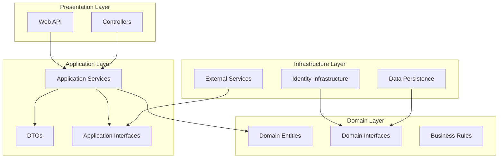

# 📘 Documentação Técnica - SecureAuth

## 📋 Índice

1. [Visão Geral](#-visão-geral)
2. [Arquitetura do Sistema](#-arquitetura-do-sistema)
3. [Estrutura de Pastas e Arquivos](#-estrutura-de-pastas-e-arquivos)
4. [Tecnologias e Dependências](#-tecnologias-e-dependências)
5. [Camadas da Aplicação](#-camadas-da-aplicação)
6. [Padrões de Design](#-padrões-de-design)
7. [Segurança](#-segurança)
8. [APIs e Endpoints](#-apis-e-endpoints)
9. [Banco de Dados](#-banco-de-dados)
10. [Testes](#-testes)
11. [Configuração e Deploy](#-configuração-e-deploy)

---

## 🎯 Visão Geral

O **SecureAuth** é uma aplicação de autenticação e autorização empresarial desenvolvida em **.NET 8** utilizando princípios de **Clean Architecture**. O sistema fornece um conjunto completo de funcionalidades de segurança, incluindo autenticação multi-fator (MFA), gestão de tokens JWT, auditoria de segurança e controle de acesso baseado em funções (RBAC).

### Objetivos Principais

- **Segurança Robusta**: Implementação de múltiplas camadas de segurança
- **Escalabilidade**: Arquitetura preparada para crescimento
- **Manutenibilidade**: Código limpo e bem estruturado
- **Testabilidade**: Cobertura completa de testes
- **Conformidade**: Aderência às melhores práticas de segurança (OWASP)

---

## 🏗️ Arquitetura do Sistema

O projeto implementa **Clean Architecture** com as seguintes camadas:



### Princípios Arquiteturais

- **Inversão de Dependência**: Camadas superiores não dependem de implementações concretas
- **Separação de Responsabilidades**: Cada camada tem uma responsabilidade específica
- **Testabilidade**: Interfaces permitem mock e isolamento de testes
- **Flexibilidade**: Fácil substituição de implementações

---

## 📁 Estrutura de Pastas e Arquivos

```
SecureAuth/
├── 📄 LICENSE
├── 📄 README.md
├── 📄 SecureAuth.sln
├── 📁 src/
│   ├── 📁 Core/
│   │   ├── 📁 SecureAuth.Core.Application/
│   │   │   ├── 📄 SecureAuth.Core.Application.csproj
│   │   │   ├── 📁 DTOs/
│   │   │   │   ├── 📄 AuthResult.cs
│   │   │   │   ├── 📄 ChangePasswordDto.cs
│   │   │   │   ├── 📄 LoginDto.cs
│   │   │   │   ├── 📄 MfaSetupDto.cs
│   │   │   │   ├── 📄 ResetPasswordDto.cs
│   │   │   │   ├── 📄 RoleDto.cs
│   │   │   │   ├── 📄 SecurityEventDto.cs
│   │   │   │   ├── 📄 SecurityLogDto.cs
│   │   │   │   ├── 📄 SecurityStatisticsDto.cs
│   │   │   │   ├── 📄 TokenResponseDto.cs
│   │   │   │   ├── 📄 UserDto.cs
│   │   │   │   └── 📄 UserRegistrationDto.cs
│   │   │   ├── 📁 Interfaces/
│   │   │   │   ├── 📄 IAuthService.cs
│   │   │   │   ├── 📄 IEmailService.cs
│   │   │   │   ├── 📄 IJwtService.cs
│   │   │   │   ├── 📄 IMfaService.cs
│   │   │   │   ├── 📄 IRoleService.cs
│   │   │   │   ├── 📄 ISecurityAuditService.cs
│   │   │   │   └── 📄 IUserService.cs
│   │   │   ├── 📁 Services/
│   │   │   │   ├── 📄 AuthService.cs
│   │   │   │   ├── 📄 JwtService.cs
│   │   │   │   ├── 📄 RoleService.cs
│   │   │   │   ├── 📄 SecurityAuditService.cs
│   │   │   │   └── 📄 UserService.cs
│   │   │   └── 📁 Settings/
│   │   │       ├── 📄 EmailSettings.cs
│   │   │       ├── 📄 JwtSettings.cs
│   │   │       └── 📄 MfaSettings.cs
│   │   └── 📁 SecureAuth.Core.Domain/
│   │       ├── 📄 SecureAuth.Core.Domain.csproj
│   │       ├── 📁 Entities/
│   │       │   ├── 📄 ApplicationRole.cs
│   │       │   ├── 📄 ApplicationUser.cs
│   │       │   ├── 📄 RefreshToken.cs
│   │       │   ├── 📄 SecurityAuditLog.cs
│   │       │   └── 📄 SecurityEventType.cs
│   │       └── 📁 Interfaces/
│   │           ├── 📄 IRefreshTokenRepository.cs
│   │           ├── 📄 IRoleRepository.cs
│   │           ├── 📄 ISecurityAuditRepository.cs
│   │           └── 📄 IUserRepository.cs
│   ├── 📁 Infrastructure/
│   │   ├── 📁 SecureAuth.Infrastructure.Identity/
│   │   │   ├── 📄 SecureAuth.Infrastructure.Identity.csproj
│   │   │   ├── 📄 DependencyInjection.cs
│   │   │   ├── 📁 Contexts/
│   │   │   │   └── 📄 ApplicationIdentityDbContext.cs
│   │   │   ├── 📁 Models/
│   │   │   │   ├── 📄 ApplicationIdentityRole.cs
│   │   │   │   └── 📄 ApplicationIdentityUser.cs
│   │   │   ├── 📁 Repositories/
│   │   │   └── 📁 Services/
│   │   └── 📁 SecureAuth.Infrastructure.Persistence/
│   │       ├── 📄 SecureAuth.Infrastructure.Persistence.csproj
│   │       ├── 📁 Contexts/
│   │       │   └── 📄 ApplicationDbContext.cs
│   │       ├── 📁 Interfaces/
│   │       ├── 📁 Models/
│   │       └── 📁 Repositories/
│   └── 📁 Web/
│       └── 📁 SecureAuth.Web.API/
│           ├── 📄 SecureAuth.Web.API.csproj
│           ├── 📄 Program.cs
│           ├── 📄 appsettings.json
│           ├── 📄 SecureAuth.Web.API.http
│           ├── 📁 Controllers/
│           │   ├── 📄 RolesController.cs
│           │   ├── 📄 SecurityController.cs
│           │   └── 📄 UsersController.cs
│           ├── 📁 Extensions/
│           └── 📁 Properties/
└── 📁 tests/
    ├── 📁 IntegrationTests/
    │   ├── 📄 SecureAuth.IntegrationTests.csproj
    │   └── 📁 Controllers/
    │       └── 📄 AuthControllerTests.cs
    └── 📁 UnitTests/
        ├── 📄 SecureAuth.UnitTests.csproj
        └── 📁 Services/
            ├── 📄 AuthServiceTests.cs
            ├── 📄 EmailServiceTests.cs
            ├── 📄 JwtServiceTests.cs
            ├── 📄 RoleServiceTests.cs
            ├── 📄 SecurityAuditServiceTests.cs
            └── 📄 UserServiceTests.cs
```

---

## 🛠️ Tecnologias e Dependências

### Framework Principal

- **.NET 8.0** - Framework principal
- **ASP.NET Core 8** - API Web
- **Entity Framework Core 8** - ORM
- **ASP.NET Identity** - Sistema de identidade

### Pacotes NuGet Principais

#### Core Application

```xml
<PackageReference Include="FluentValidation" Version="11.11.0" />
<PackageReference Include="MediatR" Version="12.5.0" />
<PackageReference Include="Microsoft.Extensions.DependencyInjection.Abstractions" Version="9.0.4" />
<PackageReference Include="Microsoft.IdentityModel.Tokens" Version="7.6.2" />
<PackageReference Include="System.IdentityModel.Tokens.Jwt" Version="7.6.2" />
<PackageReference Include="QRCoder" Version="1.6.0" />
```

#### Infrastructure Identity

```xml
<PackageReference Include="GoogleAuthenticator" Version="3.2.0" />
<PackageReference Include="Microsoft.AspNetCore.Authentication.JwtBearer" Version="8.0.4" />
<PackageReference Include="Microsoft.AspNetCore.Identity.EntityFrameworkCore" Version="8.0.4" />
<PackageReference Include="Otp.NET" Version="1.4.0" />
<PackageReference Include="QRCoder" Version="1.6.0" />
```

#### Infrastructure Persistence

```xml
<PackageReference Include="Microsoft.EntityFrameworkCore" Version="8.0.4" />
<PackageReference Include="Microsoft.EntityFrameworkCore.SqlServer" Version="8.0.4" />
```

#### Testes

```xml
<PackageReference Include="Microsoft.NET.Test.Sdk" Version="17.8.0" />
<PackageReference Include="xunit" Version="2.4.2" />
<PackageReference Include="xunit.runner.visualstudio" Version="2.4.3" />
<PackageReference Include="Moq" Version="4.20.69" />
<PackageReference Include="coverlet.collector" Version="6.0.0" />
```

---

## 📚 Camadas da Aplicação

### 1. Domain Layer (Core.Domain)

**Responsabilidade**: Contém as regras de negócio e entidades do domínio.

#### Principais Entidades:

- **ApplicationUser**: Representa um usuário do sistema
- **ApplicationRole**: Representa uma função/papel no sistema
- **RefreshToken**: Token para renovação de autenticação
- **SecurityAuditLog**: Log de eventos de segurança
- **SecurityEventType**: Tipos de eventos de segurança

#### Interfaces de Repositório:

- `IUserRepository`
- `IRoleRepository`
- `IRefreshTokenRepository`
- `ISecurityAuditRepository`

### 2. Application Layer (Core.Application)

**Responsabilidade**: Orquestra as operações e implementa casos de uso.

#### DTOs (Data Transfer Objects):

- **AuthResult**: Resultado de operações de autenticação
- **LoginDto**: Dados para login
- **UserRegistrationDto**: Dados para registro de usuário
- **MfaSetupDto**: Configuração de MFA
- **SecurityStatisticsDto**: Estatísticas de segurança

#### Serviços:

- **AuthService**: Lógica de autenticação
- **JwtService**: Gestão de tokens JWT
- **UserService**: Gestão de usuários
- **RoleService**: Gestão de funções
- **SecurityAuditService**: Auditoria de segurança

#### Configurações:

- **JwtSettings**: Configurações JWT
- **EmailSettings**: Configurações de email
- **MfaSettings**: Configurações MFA

### 3. Infrastructure Layer

#### Identity (Infrastructure.Identity)

**Responsabilidade**: Implementação do ASP.NET Identity e serviços de autenticação.

- **ApplicationIdentityDbContext**: Contexto do banco para Identity
- **ApplicationIdentityUser/Role**: Modelos do Identity
- **DependencyInjection**: Configuração de serviços

#### Persistence (Infrastructure.Persistence)

**Responsabilidade**: Acesso a dados e persistência.

- **ApplicationDbContext**: Contexto principal do banco
- Implementações dos repositórios
- Migrações do Entity Framework

### 4. Web Layer (Web.API)

**Responsabilidade**: Exposição da API REST e configuração da aplicação.

#### Controllers:

- **SecurityController**: Endpoints de segurança e auditoria
- **UsersController**: Gestão de usuários
- **RolesController**: Gestão de funções

#### Configuração:

- **Program.cs**: Configuração da aplicação
- **appsettings.json**: Configurações da aplicação

---

## 🎨 Padrões de Design

### 1. Clean Architecture

Separação clara entre camadas com dependências apontando para dentro.

### 2. Repository Pattern

Abstração da camada de acesso a dados através de interfaces.

### 3. Dependency Injection

Inversão de controle para baixo acoplamento e alta testabilidade.

### 4. CQRS (Command Query Responsibility Segregation)

Separação entre operações de leitura e escrita (implementado com MediatR).

### 5. DTO Pattern

Transferência de dados entre camadas usando objetos específicos.

### 6. Factory Pattern

Criação de objetos complexos (tokens, configurações).

### 7. Decorator Pattern

Extensão de funcionalidades sem modificar código existente.

---

## 🔒 Segurança

### Autenticação

- **JWT Tokens**: Tokens stateless com assinatura digital
- **Refresh Tokens**: Renovação segura de tokens expirados
- **Multi-Factor Authentication**: TOTP com Google Authenticator

### Autorização

- **Role-Based Access Control (RBAC)**: Controle baseado em funções
- **Claims-Based Authorization**: Autorização granular
- **Policy-Based Authorization**: Políticas personalizadas

### Proteções Implementadas

#### 1. Contra Ataques de Força Bruta

```csharp
options.Lockout.DefaultLockoutTimeSpan = TimeSpan.FromMinutes(15);
options.Lockout.MaxFailedAccessAttempts = 5;
options.Lockout.AllowedForNewUsers = true;
```

#### 2. Políticas de Senha Robustas

```csharp
options.Password.RequiredLength = 8;
options.Password.RequireDigit = true;
options.Password.RequireLowercase = true;
options.Password.RequireUppercase = true;
options.Password.RequireNonAlphanumeric = true;
```

#### 3. Validação de Email

```csharp
options.SignIn.RequireConfirmedEmail = true;
options.SignIn.RequireConfirmedAccount = true;
```

### Auditoria de Segurança

- Log de todas as tentativas de autenticação
- Rastreamento de mudanças em dados sensíveis
- Detecção de atividades suspeitas
- Relatórios de segurança

---

## 🌐 APIs e Endpoints

### Autenticação (/api/auth)

```http
POST /api/auth/register          # Registro de usuário
POST /api/auth/login             # Login
POST /api/auth/refresh-token     # Renovação de token
POST /api/auth/revoke-token      # Revogação de token
GET  /api/auth/confirm-email     # Confirmação de email
POST /api/auth/forgot-password   # Esqueci a senha
POST /api/auth/reset-password    # Reset de senha
GET  /api/auth/mfa/setup         # Configuração MFA
POST /api/auth/mfa/enable        # Habilitação MFA
POST /api/auth/mfa/verify        # Verificação MFA
```

### Usuários (/api/users)

```http
GET    /api/users                # Listar usuários
GET    /api/users/{id}           # Obter usuário
PUT    /api/users/{id}           # Atualizar usuário
DELETE /api/users/{id}           # Remover usuário
GET    /api/users/{id}/roles     # Funções do usuário
POST   /api/users/{id}/roles     # Atribuir função
DELETE /api/users/{id}/roles/{role} # Remover função
```

### Funções (/api/roles)

```http
GET    /api/roles                # Listar funções
GET    /api/roles/{id}           # Obter função
POST   /api/roles                # Criar função
PUT    /api/roles/{id}           # Atualizar função
DELETE /api/roles/{id}           # Remover função
```

### Segurança (/api/security)

```http
GET  /api/security/audit/logs                    # Logs de auditoria
GET  /api/security/audit/logs/type/{type}        # Logs por tipo
GET  /api/security/audit/logs/user/{userId}      # Logs por usuário
GET  /api/security/audit/logs/ip/{ipAddress}     # Logs por IP
GET  /api/security/audit/statistics              # Estatísticas
POST /api/security/users/{id}/lock               # Bloquear usuário
POST /api/security/users/{id}/unlock             # Desbloquear usuário
POST /api/security/audit/check-bruteforce        # Verificar força bruta
```

---

## 🗄️ Banco de Dados

### Estrutura de Bancos

O sistema utiliza **dois bancos de dados separados**:

1. **IdentityConnection**: Para dados do ASP.NET Identity
2. **DefaultConnection**: Para dados da aplicação

### Principais Tabelas

#### Identity Database

- `AspNetUsers` - Usuários
- `AspNetRoles` - Funções
- `AspNetUserRoles` - Relacionamento usuário-função
- `AspNetUserClaims` - Claims dos usuários
- `AspNetUserLogins` - Logins externos
- `AspNetUserTokens` - Tokens de usuário

#### Application Database

- `RefreshTokens` - Tokens de renovação
- `SecurityAuditLogs` - Logs de auditoria
- `ApplicationUsers` - Dados adicionais dos usuários
- `ApplicationRoles` - Dados adicionais das funções

### Migrações

```bash
# Identity Database
dotnet ef database update -p src/Infrastructure/SecureAuth.Infrastructure.Identity -s src/Web/SecureAuth.Web.API

# Application Database
dotnet ef database update -p src/Infrastructure/SecureAuth.Infrastructure.Persistence -s src/Web/SecureAuth.Web.API
```

---

## 🧪 Testes

### Estrutura de Testes

#### Testes Unitários (`tests/UnitTests`)

- **AuthServiceTests**: Testes do serviço de autenticação
- **EmailServiceTests**: Testes do serviço de email
- **JwtServiceTests**: Testes do serviço JWT
- **RoleServiceTests**: Testes do serviço de funções
- **SecurityAuditServiceTests**: Testes de auditoria
- **UserServiceTests**: Testes do serviço de usuários

#### Testes de Integração (`tests/IntegrationTests`)

- **AuthControllerTests**: Testes dos endpoints de autenticação

### Executando Testes

```bash
# Todos os testes
dotnet test

# Apenas testes unitários
dotnet test tests/UnitTests/SecureAuth.UnitTests.csproj

# Apenas testes de integração
dotnet test tests/IntegrationTests/SecureAuth.IntegrationTests.csproj

# Com cobertura de código
dotnet test /p:CollectCoverage=true /p:CoverletOutputFormat=lcov
```

### Frameworks de Teste

- **XUnit**: Framework principal de testes
- **Moq**: Mock objects para isolamento
- **Coverlet**: Cobertura de código

---

## ⚙️ Configuração e Deploy

### Configurações Principais (appsettings.json)

```json
{
  "ConnectionStrings": {
    "DefaultConnection": "Server=...;Database=SecureAuth;...",
    "IdentityConnection": "Server=...;Database=SecureAuthIdentity;..."
  },
  "JwtSettings": {
    "SecretKey": "...",
    "Issuer": "SecureAuth",
    "Audience": "SecureAuthUsers",
    "ExpirationInHours": 1,
    "RefreshTokenExpirationInDays": 7
  },
  "EmailSettings": {
    "SmtpServer": "smtp.gmail.com",
    "SmtpPort": 587,
    "SmtpUsername": "...",
    "SmtpPassword": "...",
    "FromEmail": "noreply@secureauth.com",
    "FromName": "SecureAuth System"
  },
  "MfaSettings": {
    "Issuer": "SecureAuth",
    "QRCodeSize": 200,
    "TokenValidityPeriod": 30
  }
}
```

### Variáveis de Ambiente

```bash
export ASPNETCORE_ENVIRONMENT=Production
export ASPNETCORE_URLS=https://+:443;http://+:80
export JwtSettings__SecretKey="{secret-key}"
export EmailSettings__SmtpPassword="{smtp-password}"
```

### Build e Deploy

```bash
# Build da aplicação
dotnet build --configuration Release

# Publicação
dotnet publish --configuration Release --output ./publish

# Execução
dotnet ./publish/SecureAuth.Web.API.dll
```

### Docker Support

```dockerfile
FROM mcr.microsoft.com/dotnet/aspnet:8.0 AS base
WORKDIR /app
EXPOSE 80
EXPOSE 443

FROM mcr.microsoft.com/dotnet/sdk:8.0 AS build
WORKDIR /src
COPY ["src/Web/SecureAuth.Web.API/SecureAuth.Web.API.csproj", "src/Web/SecureAuth.Web.API/"]
RUN dotnet restore "src/Web/SecureAuth.Web.API/SecureAuth.Web.API.csproj"
COPY . .
WORKDIR "/src/src/Web/SecureAuth.Web.API"
RUN dotnet build "SecureAuth.Web.API.csproj" -c Release -o /app/build

FROM build AS publish
RUN dotnet publish "SecureAuth.Web.API.csproj" -c Release -o /app/publish

FROM base AS final
WORKDIR /app
COPY --from=publish /app/publish .
ENTRYPOINT ["dotnet", "SecureAuth.Web.API.dll"]
```

---

## 📈 Monitoramento e Logging

### Logs Estruturados

- Utilização do `ILogger<T>` do .NET
- Logs em formato JSON para facilitar análise
- Níveis de log apropriados (Debug, Info, Warning, Error, Critical)

### Auditoria

- Todos os eventos de segurança são logados
- Rastreabilidade completa de ações do usuário
- Retenção de logs configurável

### Métricas

- Estatísticas de uso do sistema
- Relatórios de segurança
- Dashboards de monitoramento

---

## 🔧 Manutenção e Evolução

### Boas Práticas Implementadas

- **Código Limpo**: Nomenclatura clara e métodos pequenos
- **SOLID**: Princípios de orientação a objetos
- **DRY**: Não repetição de código
- **YAGNI**: Implementação apenas do necessário

### Extensibilidade

- Interfaces para fácil substituição de implementações
- Arquitetura modular e plugável
- Configurações externalizadas

### Versionamento da API

- Suporte a versionamento de endpoints
- Compatibilidade com versões anteriores
- Documentação automática via Swagger

---

## 📞 Suporte e Contribuição

### Documentação

- Código autodocumentado
- Comentários XML para APIs públicas
- README detalhado com exemplos

### Contribuição

- Guias de contribuição definidos
- Padrões de código estabelecidos
- Pipeline de CI/CD configurado

### Contato

- **Autor**: Marco Pezzote
- **Email**: contato@marcopezzote.tech
- **LinkedIn**: [marcopezzote](https://www.linkedin.com/in/marcopezzote/)
- **GitHub**: [marcopezzote](https://github.com/marcopezzote)

---

## 📝 Licença

Este projeto está licenciado sob a **MIT License**. Consulte o arquivo `LICENSE` para mais detalhes.

---

<div align="center">
  <sub>Documentação técnica gerada para o projeto SecureAuth v1.0</sub><br>
  <sub>Última atualização: 14 de junho de 2025</sub>
</div>
